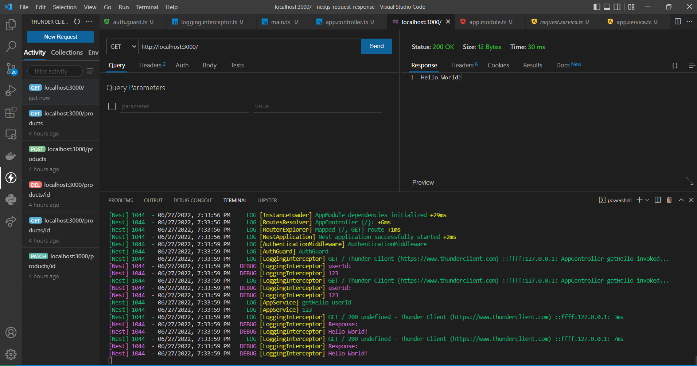

  

[circleci-image]: https://img.shields.io/circleci/build/github/nestjs/nest/master?token=abc123def456
[circleci-url]: https://circleci.com/gh/nestjs/nest

  
A progressive <a href="http://nodejs.org" target="_blank">Node.js</a> framework for building efficient and scalable server-side applications.

    

#

## Description
What's the difference between Interceptor vs Middleware vs Filter in Nest.js [(Read Answer)](https://stackoverflow.com/questions/54863655/whats-the-difference-between-interceptor-vs-middleware-vs-filter-in-nest-js)

#

## Tutorial 
[Nest.js | Middleware, Pipes & Interceptors Explained By Example](https://www.youtube.com/watch?v=x1W3FJ1RJlM) 

- Middleware ✅
- Guards ✅
- Interceptors ✅

- Pipes ✅

- Filters ✅

